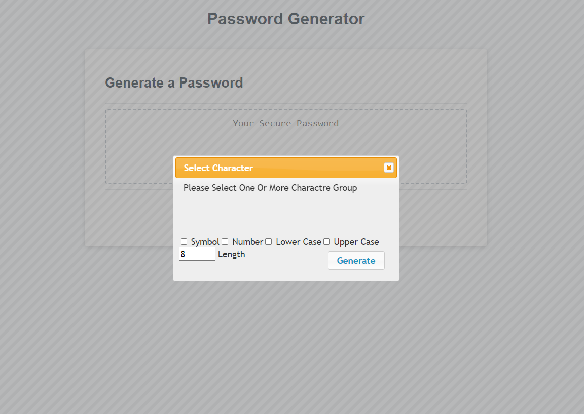
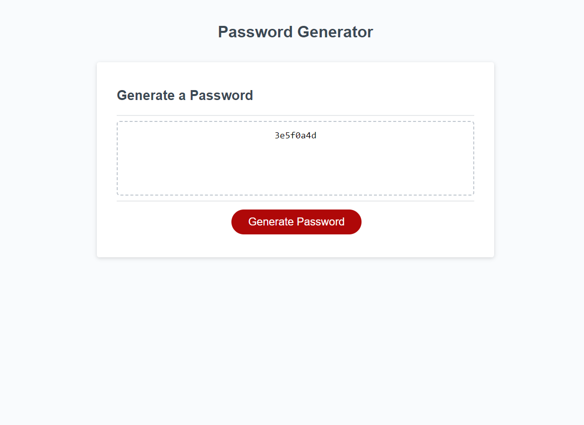

# SPM (Strong Password Manager)

## Description

this application  help those who have to constantly come up with new passwords to ensure authorized access for programs and to manage a large number of passwords for identity and access management. Other kinds of tools include a password vault, where users manage large numbers of passwords in a secure location 

## Installation

N/A

## Usage
This system create strong and random passwords for each subscriber account. The most advantaged are individuals who frequently need to create and manage new passwords. Other than creating passwords, the originators securely manage a large number of passwords. 

### Home  
When you click the button to generate a password it will presented with a series of prompts for password criteria

### Content
You can select difarent group of characters and pasword lenth.you heve to select atleast one character type.

### 

### Completed version of the web site.
 https://manojadikari.github.io/StrongPasswordManager-SPM-/

## Credits

N/A

## License
MIT license.
Please refer to the LICENSE in the repo.

